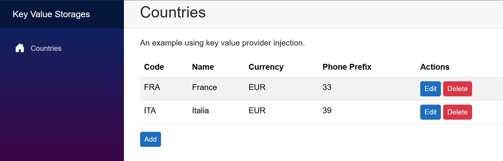

# Hexalith.KeyValueStorages.SimpleApp

## Overview

This is a sample Blazor Server application that demonstrates how to use the Hexalith.KeyValueStorages library for simple CRUD operations. The app manages a list of countries with their details (code, name, currency, and phone prefix) using a file-based key-value storage system.

## Features

- View a list of countries
- Add new countries
- Edit existing country details
- Delete countries
- Persistent storage using JSON files

## Technical Details

The application uses:
- .NET 8 and Blazor Server with interactive rendering
- Hexalith.KeyValueStorages for data persistence
- JSON-based file storage implementation

## Key Components

- **Country**: A record that represents the main data model with country details
- **CountryState**: Wrapper for Country with etag for concurrency control
- **CountryIndexState**: Manages the list of all country codes
- **Countries.razor**: Main page displaying the list of countries
- **CountryEdit.razor**: Form for adding and editing country data

## How It Works

The application demonstrates key concepts of the Hexalith.KeyValueStorages library:
1. **Key-Value Store Configuration**: The app configures a JSON file-based key-value store in Program.cs
2. **Dependency Injection**: IKeyValueProvider is injected into components
3. **Data Operations**: CRUD operations are performed using the key-value store interfaces
4. **Indexing**: A separate key-value store is used to maintain an index of all country codes

## Getting Started

1. Clone the repository
2. Build and run the application
3. Navigate to the homepage to see the list of countries
4. Use the UI to add, edit, and delete country records

## Configuration

The application uses appsettings.json for configuration. The key settings for the key-value store are:

```json
{
  "Hexalith": {
    "KeyValueStorages": {
      "StorageRootPath": "/stores",
      "Database": "key-valuesamples"
    }
  }
}
```

This configures where the JSON files for persistence will be stored, with a root path of "/stores" and a database name of "key-valuesamples".

## Data Structure Examples

The application generates the following JSON files for persistence:

### Country Data File Example

This shows how an individual country record is stored:

```json
{
  "Value": {
    "Code": "FRA",
    "Name": "France",
    "Currency": "EUR",
    "PhonePrefix": 33
  },
  "Etag": "B9vwvV1CEEShvxh4Kwy-bg",
  "TimeToLive": null
}
```

### Country Index File Example

This shows how the list of all country codes is stored:

```json
{
  "Value": ["FRA", "ITA"],
  "Etag": "XegDwARQH0KHXRz2KeBSWw",
  "TimeToLive": null
}
```

## Screenshots


